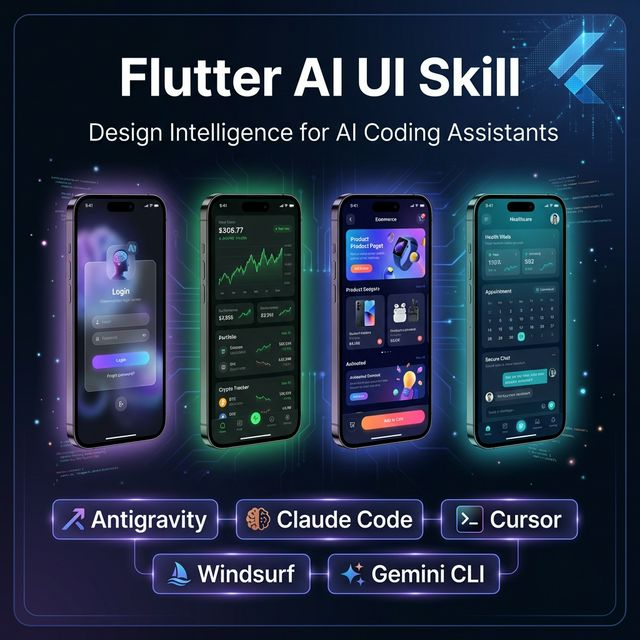
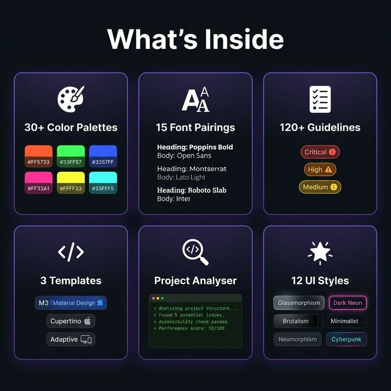

<div align="center">



<br/>

[](LICENSE)
[](https://flutter.dev)
[](https://github.com/SpeakQuery/flutter-ai-ui-skill)
[](https://github.com/SpeakQuery/flutter-ai-ui-skill/issues)
[](CONTRIBUTING.md)

**The most comprehensive Flutter UI/UX skill for AI coding assistants.**  
Instantly turns any AI into a Flutter design expert.

[**Installation**](#-installation) · [**Features**](#-features) · [**Usage**](#-usage) · [**Examples**](#-examples) · [**Contributing**](#-contributing)

</div>

---

## ✨ What is this?

**Flutter AI UI Skill** is a plug-in skill that supercharges AI coding
assistants with deep Flutter UI/UX knowledge. Instead of getting generic,
boilerplate code — you get production-ready, beautifully designed Flutter apps.



---

## 🚀 Features

| | Feature | Details |
|--|---------|---------|
| 🎨 | **30+ Color Palettes** | App-type specific: healthcare, fintech, gaming, social, e-commerce… with dark mode variants |
| 🔤 | **15 Font Pairings** | Curated Google Fonts pairs with complete Flutter `TextTheme` usage code |
| 📋 | **120+ Guidelines** | Searchable dos & don'ts across widgets, state, layout, perf, a11y, theming |
| 🖼️ | **12 UI Styles** | Material 3, Glassmorphism, Neumorphism, Dark Neon, Claymorphism, Brutalist… |
| 🛠️ | **3 Templates** | Material 3, Cupertino, and Adaptive multi-platform starters |
| 🔍 | **Project Analyser** | Scans existing projects and reports anti-patterns with fixes |
| 🔎 | **Guideline Search** | Keyword/category/severity search across all Flutter UI rules |
| ⚡ | **Project Scaffolder** | Creates new Flutter projects from templates via CLI |

---

## 📦 Installation

Choose the method that matches your AI coding assistant:

### ⚡ Antigravity (Recommended)

```bash
git clone https://github.com/SpeakQuery/flutter-ai-ui-skill \
  .agents/skills/flutter-ai-ui-skill
```

The skill activates automatically when you ask for Flutter UI/UX work.

### Claude Code

```bash
git clone https://github.com/SpeakQuery/flutter-ai-ui-skill \
  .claude/skills/flutter-ai-ui-skill
```

Add to your `CLAUDE.md`:
```markdown
## Skills
- .claude/skills/flutter-ai-ui-skill/SKILL.md
```

### Cursor

```bash
git clone https://github.com/SpeakQuery/flutter-ai-ui-skill \
  .cursor/skills/flutter-ai-ui-skill
```

Add to `.cursor/rules/flutter-ui.mdc`:
```
@flutter-ai-ui-skill/SKILL.md
```

### Windsurf

```bash
git clone https://github.com/SpeakQuery/flutter-ai-ui-skill \
  .windsurf/skills/flutter-ai-ui-skill
```

Add to `.windsurf/rules/flutter-ui.md`:
```
@flutter-ai-ui-skill/SKILL.md
```

### Gemini CLI

```bash
git clone https://github.com/SpeakQuery/flutter-ai-ui-skill \
  flutter-ai-ui-skill
```

Add to your `GEMINI.md`:
```markdown
## Active Skills
- flutter-ai-ui-skill/SKILL.md
```

### GitHub Copilot

```bash
git clone https://github.com/SpeakQuery/flutter-ai-ui-skill \
  .github/skills/flutter-ai-ui-skill
```

Add to `.github/copilot-instructions.md`:
```markdown
## Flutter UI/UX Skill
See: .github/skills/flutter-ai-ui-skill/SKILL.md
```

### Other Platforms (Kiro · Roo Code · Continue · OpenCode · Zed)

```bash
git clone https://github.com/SpeakQuery/flutter-ai-ui-skill \
  flutter-ai-ui-skill
```

Reference `flutter-ai-ui-skill/SKILL.md` in your platform's rules file.

### 🔄 Updating

```bash
cd path/to/flutter-ai-ui-skill && git pull
```

---

## 💡 Usage

### Auto-Activation (Skill Mode)

Works on: Antigravity, Claude Code, Cursor, Windsurf, Gemini CLI, Continue

Just ask naturally in your Flutter project:

```
Build a glassmorphism login screen with email and password
```

```
Design a fintech dashboard with dark theme and green profit indicators
```

```
Create a healthcare app home screen with a calm, minimal style
```

```
Improve my existing home page — it looks too basic
```

### Slash Command Mode

Works on: Kiro, GitHub Copilot, Roo Code

```
/flutter-ai-ui Build a settings screen for a fintech app
```

---

## 🖼️ Examples

Real screens built with this skill. Browse the [`examples/`](examples/) folder.

| Example | Style | Description |
|---------|-------|-------------|
| [Glassmorphism Login](examples/glassmorphism_login/) | Glassmorphism | Frosted glass login with gradient background |
| *(More coming — contributions welcome!)* | | |

> 💡 **Built something cool with this skill?** [Add your example!](CONTRIBUTING.md)

---

## 🛠️ Using the Scripts

### Analyse Your Existing Project

```bash
python scripts/analyse_flutter_project.py --path /path/to/your/flutter/project
```

```
━━━━━━━━━━━━━━━━━━━━━━━━━━━━━━━━━━━━━━━━━━━━━━━━━━━━━━━━━━━━
🎨 Flutter AI UI — Project Audit Report
━━━━━━━━━━━━━━━━━━━━━━━━━━━━━━━━━━━━━━━━━━━━━━━━━━━━━━━━━━━━

  📁 Project : my_flutter_app
  🗂️  Files   : 24 Dart files analysed
  🧱 Widgets : 12 StatefulWidget, 31 StatelessWidget
  📊 Stateful ratio: 28% (target < 30%) ✅

  🔴 CRITICAL : 2
  🟠 HIGH     : 5
  🟡 MEDIUM   : 3
  🟢 LOW      : 1
```

### Search Guidelines

```bash
# Search by keyword
python scripts/search_guidelines.py --keyword "animation"

# Search by category
python scripts/search_guidelines.py --category "accessibility"

# Filter by severity + show code examples
python scripts/search_guidelines.py --severity "critical" --examples

# List all categories
python scripts/search_guidelines.py --list-categories
```

### Create a New Project from Template

```bash
# List available templates
python scripts/create_flutter_project.py --list-templates

# Create Material 3 project
python scripts/create_flutter_project.py --name my_app --template material3

# Create iOS-native Cupertino project
python scripts/create_flutter_project.py --name my_app --template cupertino

# Create adaptive multi-platform project
python scripts/create_flutter_project.py --name my_app --template adaptive
```

---

## 📚 Documentation

### Data Files

| File | Contents |
|------|----------|
| `data/flutter_colors.csv` | 30+ app-type palettes with light & dark mode hex values |
| `data/flutter_typography.csv` | 15 Google Fonts pairings with `pubspec.yaml` + Dart code |
| `data/flutter_animations.csv` | 20 animation patterns (duration, curve, widget, code) |
| `data/flutter_components.csv` | 20 component blueprints (Card, FAB, Dialog, List, etc.) |
| `data/stacks/flutter_guidelines.csv` | 120+ Flutter UI guidelines with severity levels |

### Templates

| Template | Description |
|----------|-------------|
| `templates/material3/` | Material 3 + GoRouter + Riverpod + GoogleFonts + dark mode |
| `templates/cupertino/` | iOS-native Cupertino + CupertinoTabScaffold + CupertinoListSection |
| `templates/adaptive/` | Adaptive NavigationBar (mobile) / Rail (tablet) / Drawer (desktop) |

---

## 🎨 UI Styles Supported

| Style | Description |
|-------|-------------|
| Material 3 Clean | Google's latest design language with tonal color |
| Cupertino Native | iOS-native with system components |
| Glassmorphism | Frosted glass with `BackdropFilter` + `ImageFilter.blur` |
| Neumorphism | Soft embossed shadows, monochromatic depth |
| Dark Neon | Glowing neon accents on dark backgrounds |
| Claymorphism | Soft, pillowy 3D-like components |
| Gradient Premium | Rich layered `LinearGradient` / `RadialGradient` |
| Minimal Flat | Clean, generous whitespace |
| Brutalist | Bold, raw, high-contrast |
| Organic Biophilic | Natural forms, earth tones, custom clip paths |
| Enterprise Dark | Professional dark dashboard aesthetic |
| Retro/Y2K | Nostalgic, pixel-inspired, bold colors |

---

## 🤖 Supported AI Platforms

| Platform | Method | Status |
|----------|--------|--------|
| **Antigravity** | Auto-activation | ✅ Full |
| **Claude Code** | CLAUDE.md skill | ✅ Full |
| **Cursor** | Rules file | ✅ Full |
| **Windsurf** | Rules file | ✅ Full |
| **GitHub Copilot** | Instructions file | ✅ Full |
| **Gemini CLI** | GEMINI.md | ✅ Full |
| **Kiro** | Spec/Hooks | ✅ Full |
| **Roo Code** | Rules | ✅ Full |
| **OpenCode** | Config | ✅ Full |
| **Continue** | Config rules | ✅ Full |
| **Zed** | Settings | ✅ Full |
| **Codex CLI** | System prompt | ✅ Full |
| **Codebuddy** | Rules | ✅ Full |

---

## 🏗️ Architecture

```
flutter-ai-ui-skill/
├── SKILL.md                            ← Core AI instruction file (start here)
├── README.md                           ← This file
├── CHANGELOG.md                        ← Version history
├── CONTRIBUTING.md                     ← How to contribute
├── LICENSE                             ← MIT
├── .github/
│   ├── assets/                         ← Images for README
│   └── ISSUE_TEMPLATE/                 ← Bug report / Feature request templates
├── data/
│   ├── flutter_colors.csv              ← 30+ color palettes
│   ├── flutter_typography.csv          ← 15 Google Fonts pairings
│   ├── flutter_animations.csv          ← 20 animation patterns
│   ├── flutter_components.csv          ← 20 component blueprints
│   └── stacks/
│       └── flutter_guidelines.csv      ← 120+ Flutter UI guidelines
├── scripts/
│   ├── analyse_flutter_project.py      ← Project audit tool
│   ├── search_guidelines.py            ← Guideline search utility
│   └── create_flutter_project.py       ← Project scaffolder
├── templates/
│   ├── material3/                      ← Material 3 starter
│   ├── cupertino/                      ← iOS Cupertino starter
│   └── adaptive/                       ← Multi-platform adaptive starter
└── examples/
    ├── README.md                       ← Gallery index
    └── glassmorphism_login/            ← Frosted glass login example
```

---

## 🤝 Contributing

We welcome contributions! See [CONTRIBUTING.md](CONTRIBUTING.md) for:
- How to add new color palettes
- How to add new font pairings
- How to add Flutter guidelines
- How to submit examples
- PR process and review guidelines

---

## 📄 License

MIT License — free to use, modify, and distribute. See [LICENSE](LICENSE).

---

## ⭐ Star History

If this skill helps you build better Flutter UIs with AI, please **star the repo** ⭐  
It helps more Flutter developers discover this tool!

---

<div align="center">

**Built with ❤️ for the Flutter & AI developer community**

[GitHub](https://github.com/SpeakQuery/flutter-ai-ui-skill) · [Issues](https://github.com/SpeakQuery/flutter-ai-ui-skill/issues) · [Discussions](https://github.com/SpeakQuery/flutter-ai-ui-skill/discussions) · [CHANGELOG](CHANGELOG.md)

</div>
